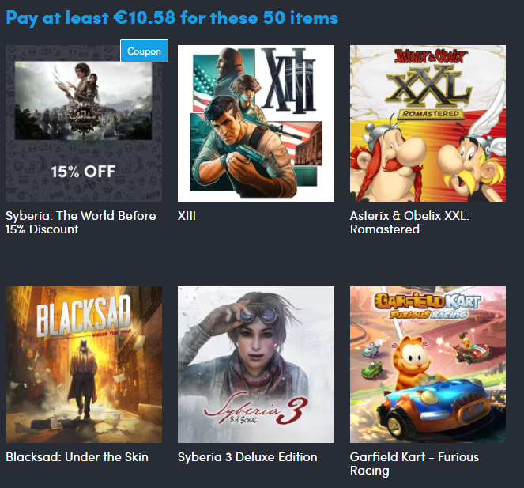
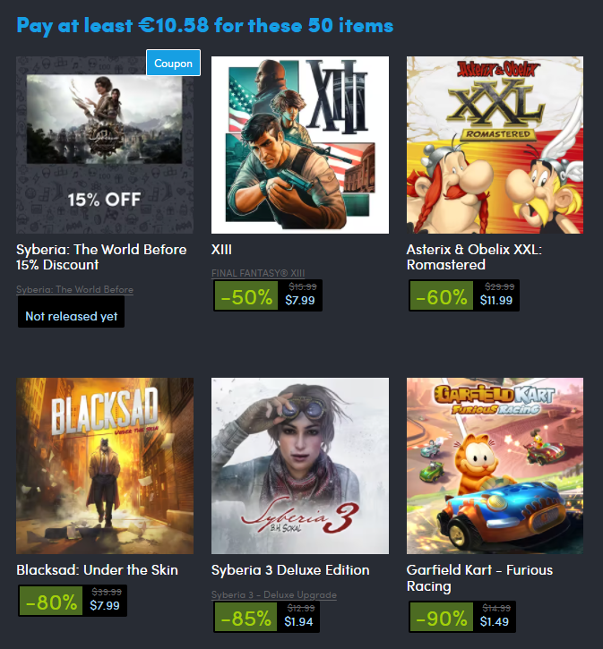

# Humble Bundle Steam info extension
This Chrome extension adds Steam details to the Humble Bundle overviews.

## Before

## After

The whole block is a link to the Steam store page.

It uses a simple Steam web search to find the correct game. However, since Steam doesn't order its search results
properly, sometimes it finds the wrong game. See for example the second result in the "After" image.
When the extension isn't sure if it's found the correct game, it'll add the name it found, 
so you can easily see if the displayed information is correct. It'll link to the Steam Search page in that case,
so you should be able to find the correct page yourself easily.

The extension calls a [Google Cloud function](cloud-function) to resolve the Steam data.
This means any localization info is lost, and you'll get US-based results.
There's not much I can do about this, but if you can find a way to load and parse the Steam page from the browser
in the extension itself (avoiding CORS errors and other roadblocks), I'll happily accept a pull request.

Do you like this extension? You can buy me a cup of coffee, or help pay for the Google Cloud hosting!

